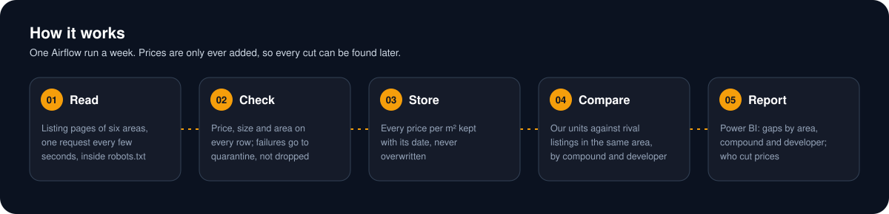
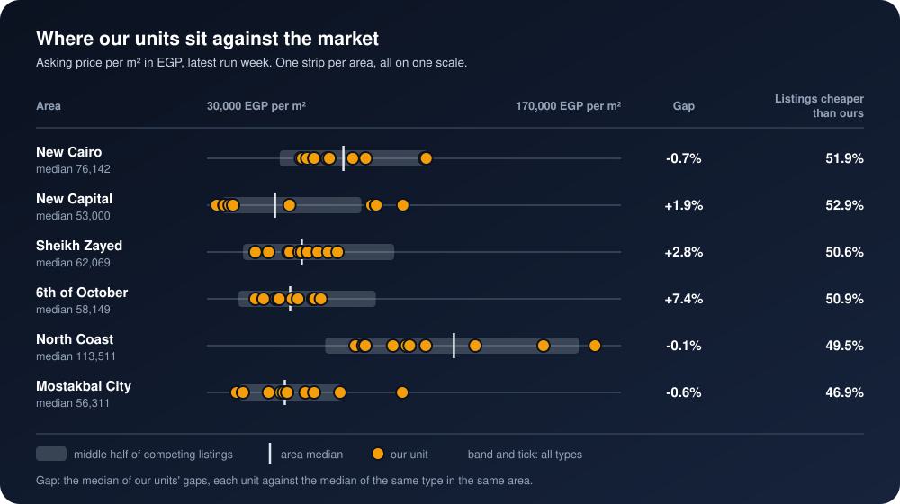
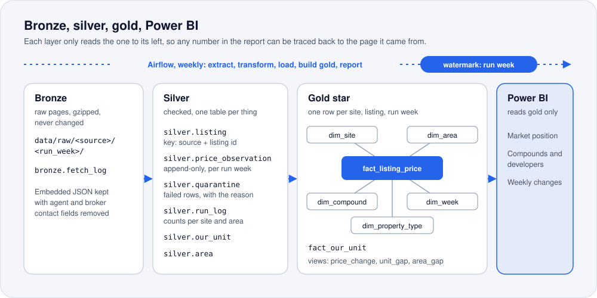

<p align="center">
  
</p>

<p align="center">
  
  
  
  
  
</p>

<h3 align="center">Know every week how your asking price per m² compares with the market,<br>who cut prices, and where the gap is widest.</h3>

## The problem

An Egyptian developer or brokerage sells units in New Cairo, the New Capital, Sheikh Zayed and
the other growth areas, against competing listings on half a dozen sites. Someone checks
a few of those sites by hand, now and then. Nobody can say, week by week, how our asking price per
square metre compares with the units around it, which competitors cut their prices, or in which
area and compound the gap is widest. The old prices were never written down, so a cut can only be
guessed at, never shown.

## 🛠️ The solution

An extract, transform and load ("ETL") pipeline that runs once a week on its own, keeps every
asking price it sees with its date, and compares our units with the competing listings in the same
area, compound by compound and developer by developer.

<p align="center">
  
</p>

1. **Extract.** Six listing sites, six areas, every week. Four sites are read by the Airflow run
   itself with plain HTTP, one request every 2.5 seconds. The other two are read once a week by a
   visible browser on one machine, one page every 5 seconds; their saved pages join the same run.
   Every page is kept as it came, gzipped, filed by site and run week.
2. **Check.** Every row is checked for a price, a size, an area and a unit type before it goes
   any further. A row that fails goes to quarantine with the reason, so nothing is dropped
   without a trace.
3. **Store.** Every asking price, size and price per m² is kept by site, listing and run week.
   Nothing is updated or deleted, so any week can be looked at again later.
4. **Compare.** Our units are set against the competing listings of the same type in the same
   area, and split by compound and developer: how far each unit sits from the area median, and
   how many listings ask less.
5. **Report.** Power BI pages for the gaps by area, compound and developer, and for who cut
   prices week by week.

### 🔁 The mental model: one strip per area

<p align="center">
  
</p>

Each area is one strip on one price-per-m² scale. The band is the middle half of the competing
listings, the tick is the area median, and the dots are our units. A dot to the right of the tick
asks more than the market; the further right, the wider the gap. The strips are drawn from the
latest run week; because every week is kept, the same picture can be drawn for any earlier week,
and a competitor's cut is found by comparing a listing's price per m² with its own price the week
before.

Under the picture are three layers, and each one only reads the layer to its left:

<p align="center">
  
</p>

- **Bronze** keeps the raw pages, gzipped and never changed, under `data/raw/<source>/<run_week>/`,
  and logs every request in `bronze.fetch_log`. For the sites whose pages embed JSON, bronze
  keeps that JSON with the agent and broker contact fields removed.
- **Silver** holds the checked rows: `silver.listing` (one row per site and listing; key: source
  plus listing id), `silver.price_observation` (append-only, one row per site, listing and run
  week), `silver.quarantine` (the rows that failed the check, with the reason), `silver.run_log`
  (counts per site and area for each run, reconciled), `silver.our_unit` and `silver.area`.
- **Gold** is a star schema: `gold.fact_listing_price` (one row per site, listing and run week:
  asking price, size in m², price per m²) with `gold.dim_site`, `gold.dim_area`,
  `gold.dim_compound` (with its developer), `gold.dim_property_type` and `gold.dim_week`;
  `gold.fact_our_unit` (one row per unit of ours); and the views `gold.price_change`,
  `gold.unit_gap` and `gold.area_gap`. Power BI reads gold only.

The watermark is the run week. A week that is already extracted is skipped, so a rerun gives the
same rows.

## 📦 For developers and brokerages

**What you get every week**

- Your asking price per m² against the competing listings, by area, compound and developer.
- The price-cut report: which listings asked less per m² than the week before, and where your gap is widest.
- The Power BI report, refreshed from the gold layer after every run.
- The full listing history: every asking price with its run week, from the first run on.

**What I need from you**

- Your units as one CSV: area, compound, type, size in m² and asking price.
- The areas to watch.
- An email address, if you want me to send you the weekly summary.

**How it runs**

- One Docker stack, run weekly by Airflow, on your machine or hosted by me.
- Bayut Egypt and Aqarmap are read by a short browser script, once a week.

## 📈 The result

**<!--nb:listings_compared-->…<!--/nb--> competing listings compared with our units across six
areas and <!--nb:sites_read-->…<!--/nb--> sites: the widest gap is
in <!--nb:widest_gap_area-->…<!--/nb-->, at <!--nb:widest_gap_pct-->…<!--/nb-->% against the
area median.** The checks behind every number are in [the notebook](analysis/analysis.ipynb).

- **History:** <!--nb:price_observations-->…<!--/nb--> asking prices kept
  over <!--nb:run_weeks-->…<!--/nb--> weekly runs
  (<!--nb:first_run_week-->…<!--/nb--> to <!--nb:latest_run_week-->…<!--/nb-->).
- **Coverage:** <!--nb:compounds_covered-->…<!--/nb--> compounds
  from <!--nb:developers_covered-->…<!--/nb--> developers, against
  our <!--nb:our_units-->…<!--/nb--> units.
- **Where we stand:** <!--nb:share_listings_cheaper_than_ours-->…<!--/nb-->% of competing listings
  ask less per m² than our unit of the same type in the same area.
- **Who cut prices:** <!--nb:price_cuts-->…<!--/nb--> listings asked less per m² in the latest run
  week than the week before.
- **Checks:** <!--nb:quarantined_rows-->…<!--/nb--> rows went to quarantine
  (<!--nb:quarantine_share_pct-->…<!--/nb-->% of all rows read), each with its reason; every run's
  counts reconcile site by site and area by area.
- **Run time:** a weekly run takes <!--nb:run_minutes-->…<!--/nb--> minutes.

<!-- Notebook charts go here once the notebook has drawn them: docs/*.png -->

## 📊 Power BI

The report reads the gold layer directly. The [powerbi/](powerbi/) folder rebuilds it from an
empty file by copy and paste: the queries, the model, every measure, every visual with its fields,
the theme, and the numbers each card must show.
<!-- Screenshots of the three pages go here once the report is built: powerbi/screenshots/ -->

## ▶️ Run it

You need Docker Desktop. In PowerShell:

```powershell
git clone https://github.com/omarshalabyy1/egypt-real-estate-prices
cd egypt-real-estate-prices
Copy-Item .env.example .env      # set WAREHOUSE_PASSWORD
docker compose up -d --build     # Airflow http://127.0.0.1:8101, warehouse 127.0.0.1:5451
```

Open Airflow at http://127.0.0.1:8101, unpause `egypt_real_estate_prices` and trigger it. It then
runs once a week: extract, transform, load silver, build gold, report.

Once a week, before the run, read the two browser sites on your own machine. It opens a visible
browser and saves their pages for the run to pick up:

```powershell
python fetch_bayut_aqarmap.py
```

Then the numbers and the tests:

```powershell
pip install -r analysis/requirements.txt
```

```powershell
jupyter lab analysis/analysis.ipynb
```

```powershell
pip install -r requirements.txt pytest
```

```powershell
pytest
```

| Where | What |
|---|---|
| [tracker.py](tracker.py) | The steps: extract, transform, load, build gold, report; one function each |
| [sites.py](sites.py) | Reading and parsing Property Finder Egypt, Dubizzle (OLX) Egypt and Nawy |
| [browser_sites.py](browser_sites.py) | Parsing the saved Bayut Egypt and Aqarmap pages |
| [fetch_bayut_aqarmap.py](fetch_bayut_aqarmap.py) | The weekly browser run for Bayut Egypt and Aqarmap |
| [dags/egypt_prices.py](dags/egypt_prices.py) | The weekly Airflow DAG `egypt_real_estate_prices` |
| [sql/schema.sql](sql/schema.sql) | The bronze, silver and gold tables and the gold views |
| [data/](data/) | The areas, each site's search address per area, and our units |
| [make_units.py](make_units.py) | How our units were made (run once) |
| [analysis/](analysis/) | The notebook behind every number |
| [powerbi/](powerbi/) | The report, step by step |
| [tests/](tests/) | Page parsing for every site, and the checks |

## 🗂️ Data

- **Competing listings:** residential units for sale in six areas (New Cairo, New Capital, Sheikh
  Zayed, 6th of October, North Coast and Mostakbal City), asking prices as each site shows them on
  the day of the run.
  - Read by the weekly Airflow run, one request every 2.5 seconds:
    [realestate.eg](https://realestate.eg),
    [Property Finder Egypt](https://www.propertyfinder.eg),
    [Dubizzle (OLX) Egypt](https://www.dubizzle.com.eg) and
    [Nawy](https://www.nawy.com).
  - Read once a week by a visible browser on one machine, one page every 5 seconds:
    [Bayut Egypt](https://www.bayut.eg) and [Aqarmap](https://aqarmap.com.eg).
- **No contact data:** no agent, broker or owner names, phone numbers or emails are stored.
- **Our units** ([data/our_units.csv](data/our_units.csv)) are made up by
  [make_units.py](make_units.py): units inside real compounds seen on the sites, each priced near
  the market for its type and area, some above and some below. The client is not named; the
  competing listings are real.

<!--
Notebook slots. Every nb:KEY marker pair in this file (and every <tspan id="nb-KEY"> in docs/*.svg)
holds the single character "…" until the notebook writes the measured value in its place. Each slot
holds the bare value only: no unit, no "%" sign and no "EGP" (those are written outside the slot).
Counts are whole numbers with thousands separators; percentages have one decimal; prices per m² are
whole EGP with thousands separators; dates are written like 4 October 2026. A slot marker never
starts a line (GitHub would end the paragraph there), so keep a word before it when reflowing. Unless a line says
otherwise, "latest run week" is the newest week in gold.dim_week.

README.md
listings_compared                 count of competing listings (gold.fact_listing_price rows) in the latest run week in the six areas
sites_read                        count of sites with at least one row in gold.fact_listing_price in the latest run week
widest_gap_area                   area name (as in silver.area) where our units' median price per m² is furthest from the area median, latest run week
widest_gap_pct                    that gap in percent, signed (+ means we ask more than the area median)
price_observations                count of rows in silver.price_observation, all run weeks
run_weeks                         count of run weeks in silver.price_observation
first_run_week                    the earliest run week, as a date
latest_run_week                   the latest run week, as a date
compounds_covered                 count of distinct compounds in gold.dim_compound with at least one listing
developers_covered                count of distinct developers in gold.dim_compound with at least one listing
our_units                         count of rows in gold.fact_our_unit
share_listings_cheaper_than_ours  percent of competing listings, latest run week, whose price per m² is below that of our median unit of the same type in the same area
price_cuts                        count of listings in gold.price_change whose price per m² fell between the run week before the latest and the latest
quarantined_rows                  count of rows in silver.quarantine, all run weeks
quarantine_share_pct              quarantined rows as a percent of all rows read (silver.price_observation plus silver.quarantine)
run_minutes                       minutes of the latest successful DAG run, start to end

docs/header.svg
listings_compared, widest_gap_pct, widest_gap_area   as above

docs/price-gap-by-area.svg (the notebook redraws this file, positions included)
scale_min_m2                      left end of the shared price-per-m² scale, EGP
scale_max_m2                      right end of the shared price-per-m² scale, EGP
median_m2_<area>                  area median price per m² of competing listings, EGP, latest run week
gap_pct_<area>                    our units' median price per m² against that area median, percent, signed
share_cheaper_<area>              percent of that area's competing listings asking less per m² than our median unit
  where <area> is one of: new_cairo, new_capital, sheikh_zayed, sixth_october, north_coast, mostakbal_city
-->
