<p align="center">
  
</p>

<p align="center">
  
  
  
  
  
</p>

<h3 align="center">Know every week how your asking price per m² compares with the market,<br>who cut prices, and where the gap is widest.</h3>

## The problem

An Egyptian developer or brokerage sells units in New Cairo, the New Capital, Sheikh Zayed and the
other growth areas, against competing listings on <!--nb:sites_read-->6<!--/nb--> listing sites that someone checks by hand,
now and then. Nobody can say, week by week, how our asking price per m² compares with the units
around it, who cut prices, or in which area and compound the gap is widest. The old prices were
never written down, so a cut can only be guessed at, never shown.

## 🛠️ The solution

A pipeline that runs once a week on its own and keeps every asking price it sees.

<p align="center">
  
</p>

1. **Collect.** Asking prices for units for sale in <!--nb:areas_read-->6<!--/nb--> areas, from <!--nb:sites_read-->6<!--/nb--> listing sites, every week.
2. **Check.** Every row needs a price, a size, an area and a type; a failure is kept with its reason.
3. **Store.** Every asking price goes into the history with its week, never updated or deleted.
4. **Compare.** Our units against the listings of the same type in the same area, by compound and developer.
5. **Report.** Power BI pages for the gaps and for who cut prices, week by week.

### 🔁 The mental model: one strip per area

<p align="center">
  
</p>

Each area is one strip on one price-per-m² scale: the band is the middle half of the competing
listings and the tick is their median, both over all unit types; the dots are our units. The gap
beside the strip compares each unit with the median of the same type in the same area, so a dot
left of the tick can still ask more than the units of its own type. Every week is kept, so the same
picture can be drawn for any earlier week, and a cut is a listing asking less per m² than it did
the week before.

## 📸 The pipeline running

The weekly run of <!--nb:latest_run_week-->4 October 2026<!--/nb--> in Airflow, and the warehouse tables it wrote.

<p align="center">
  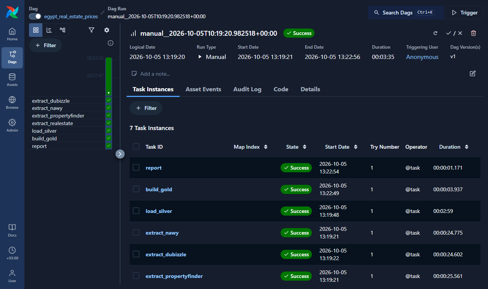
  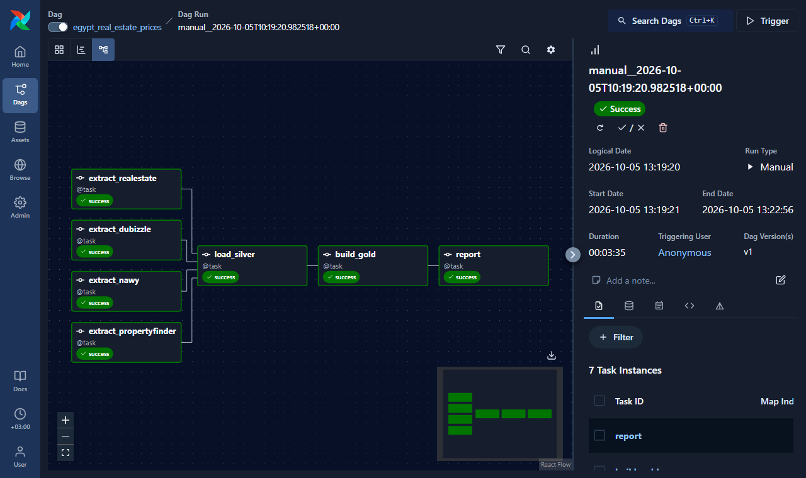
</p>
<p align="center"><sub>Left: the grid view, every task of the run green. Right: the graph, one extract per site, then load_silver, build_gold and report.</sub></p>

<p align="center">
  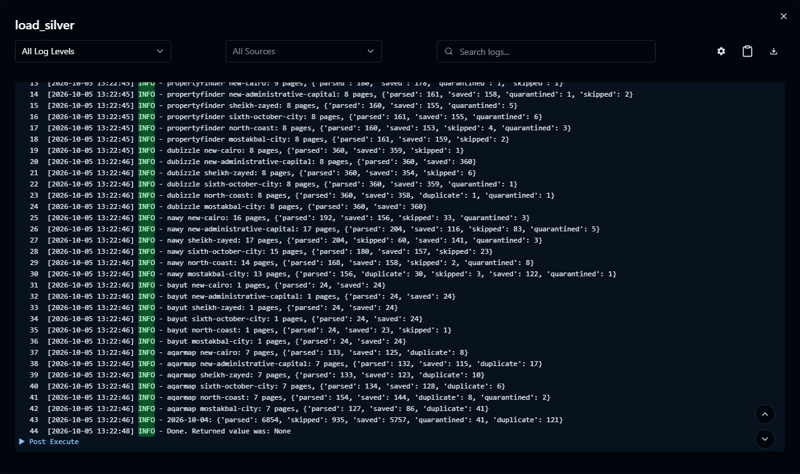
  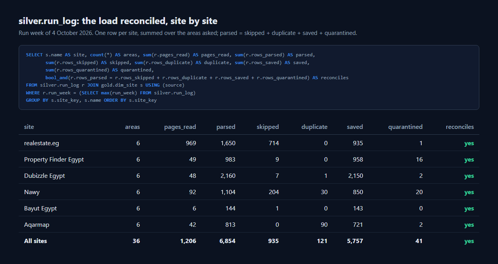
</p>
<p align="center"><sub>Left: the load_silver log, ending with the week's totals. Right: silver.run_log per site, where parsed = skipped + duplicate + saved + quarantined.</sub></p>

<p align="center">
  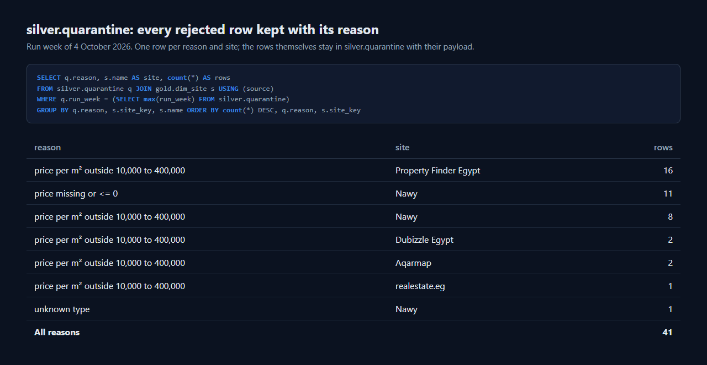
</p>
<p align="center"><sub>silver.quarantine by reason and site: a rejected row is kept with its reason, never dropped.</sub></p>

## 📈 The result

**<!--nb:listings_compared-->5,619<!--/nb--> competing listings compared with our units across <!--nb:areas_read-->6<!--/nb-->
areas and <!--nb:sites_read-->6<!--/nb--> sites: the widest gap is
in <!--nb:widest_gap_area-->6th of October<!--/nb-->, at <!--nb:widest_gap_pct-->+7.4<!--/nb-->% against the
median of the same type in the same area.** The checks behind every number are in [the notebook](analysis/analysis.ipynb).

- **<!--nb:price_observations-->5,757<!--/nb--> asking prices** kept
  over <!--nb:run_weeks_phrase-->1 weekly run<!--/nb-->
  (<!--nb:first_run_week-->4 October 2026<!--/nb--> to <!--nb:latest_run_week-->4 October 2026<!--/nb-->).
- **<!--nb:compounds_covered-->1,152<!--/nb--> compound names** (as the sites write them)
  from <!--nb:developers_covered-->307<!--/nb--> developers covered, against our <!--nb:our_units-->60<!--/nb--> units.
- **<!--nb:share_listings_cheaper_than_ours-->50.4<!--/nb-->% of the <!--nb:listings_in_our_types-->4,929<!--/nb--> competing listings** in
  the areas and types where we have units ask less per m² than our median unit of that type and area.
- **<!--nb:quarantined_rows-->41<!--/nb--> rows set aside** with their reason
  (<!--nb:quarantine_share_pct-->0.7<!--/nb-->% of all rows read), most often "<!--nb:i12_top_reason-->price per m² outside 10,000 to 400,000<!--/nb-->"
  (<!--nb:i12_top_reason_rows-->29<!--/nb--> rows); every run's counts reconcile site by site and area by area.
- **<!--nb:i1_premium_pct-->114.2<!--/nb-->% more per m²** asked in <!--nb:i1_dearest_area-->North Coast<!--/nb--> than
  in <!--nb:i1_cheapest_area-->New Capital<!--/nb-->, the cheapest area, comparing median asking prices.
- **The 90th percentile <!--nb:i10_widest_p90_over_p10_pct-->369.1<!--/nb-->% above the 10th** in asking price per m²
  in <!--nb:i10_widest_area-->North Coast<!--/nb-->, the widest spread; the narrowest is <!--nb:i10_narrowest_area-->Mostakbal City<!--/nb-->, at <!--nb:i10_narrowest_p90_over_p10_pct-->218.6<!--/nb-->%.
- **<!--nb:i5_types_lower_in_largest_band-->7<!--/nb--> of <!--nb:i5_types_compared-->9<!--/nb--> unit types** ask less per m² in their largest size band
  than in their smallest; different listings side by side, not the effect of size.
- **Index <!--nb:i3_top_index-->219<!--/nb--> for <!--nb:i3_top_developer-->ADD Properties<!--/nb-->**, the dearest of <!--nb:i3_developers-->48<!--/nb--> developers
  with 10 or more listings (100 = the area median); the lowest is <!--nb:i3_bottom_developer-->Amer Group<!--/nb--> at <!--nb:i3_bottom_index-->62<!--/nb-->.
- **Nawy above Dubizzle in <!--nb:i6_nawy_above_areas-->6<!--/nb--> of <!--nb:i6_areas_compared-->6<!--/nb--> areas** by median asking price per m²;
  Nawy shows mostly developers' launch prices and Dubizzle is a resale marketplace, the likely reason.
- **From <!--nb:i11_lowest_read_pct-->0.1<!--/nb-->% to <!--nb:i11_highest_read_pct-->12.5<!--/nb-->% of each site's own count** read each week,
  from <!--nb:i11_lowest_site-->Bayut Egypt<!--/nb--> to <!--nb:i11_highest_site-->realestate.eg<!--/nb-->: a sample of each site, not all of it.

### 🖼️ Every chart from the notebook

<p align="center">
  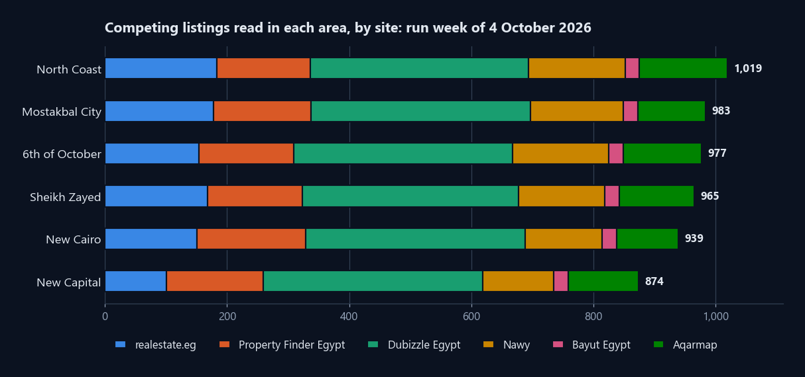
</p>
<p align="center"><sub>Competing listings read in each area, stacked by site.</sub></p>

<p align="center">
  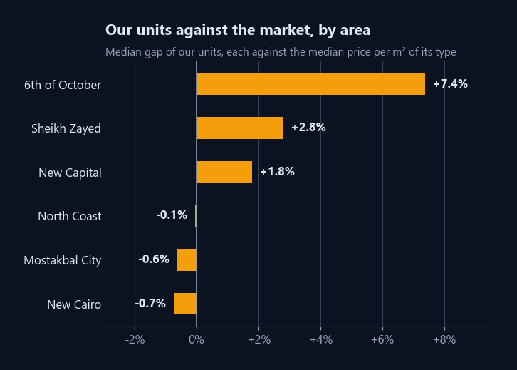
  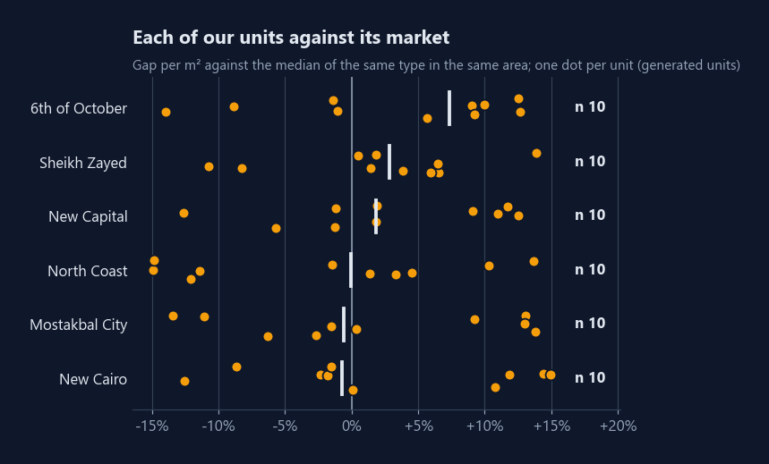
</p>
<p align="center"><sub>Left: our median gap by area. Right: every unit of ours against its market, one amber dot each.</sub></p>

<p align="center">
  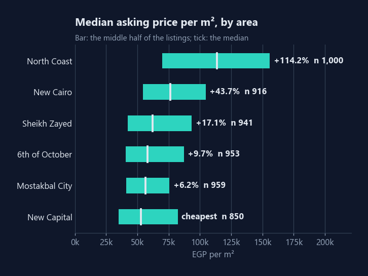
  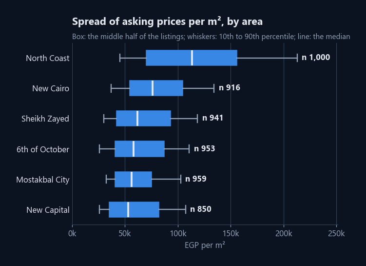
</p>
<p align="center"><sub>Left: areas ranked by median price per m². Right: the spread in each area, 10th to 90th percentile.</sub></p>

<p align="center">
  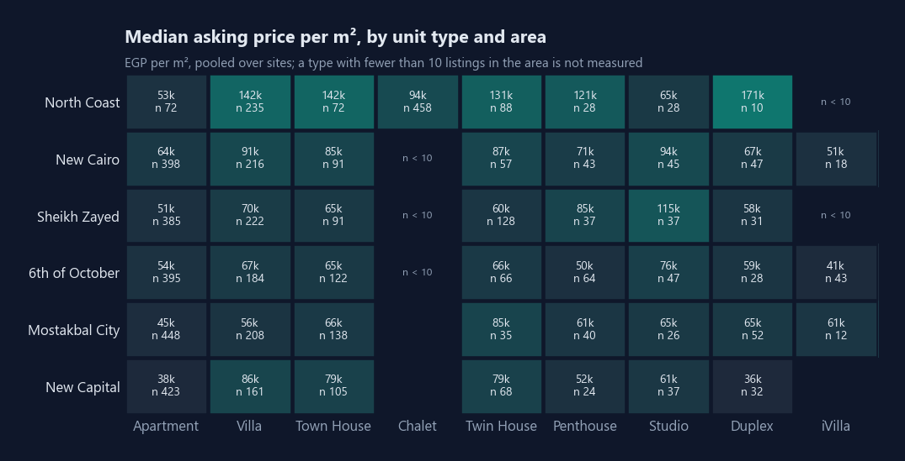
</p>
<p align="center"><sub>Median price per m² by area and unit type, with n in each cell; small groups are not measured.</sub></p>

<p align="center">
  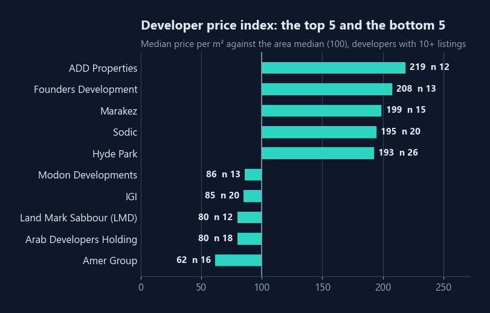
  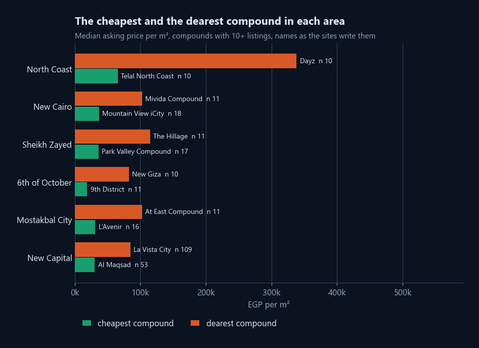
</p>
<p align="center"><sub>Left: developers against their area median (100). Right: the cheapest and the dearest compound in each area.</sub></p>

<p align="center">
  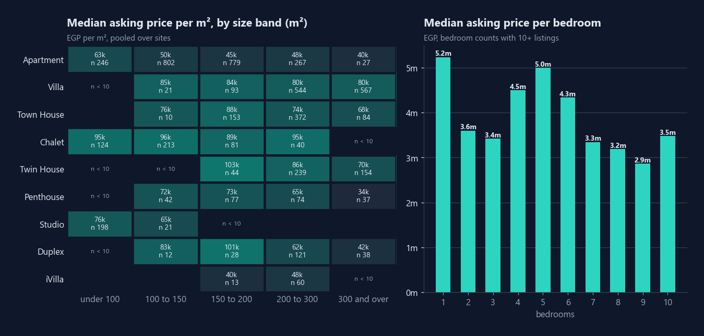
</p>
<p align="center"><sub>Price per m² by size band, and price per bedroom: listings side by side, not the effect of size.</sub></p>

<p align="center">
  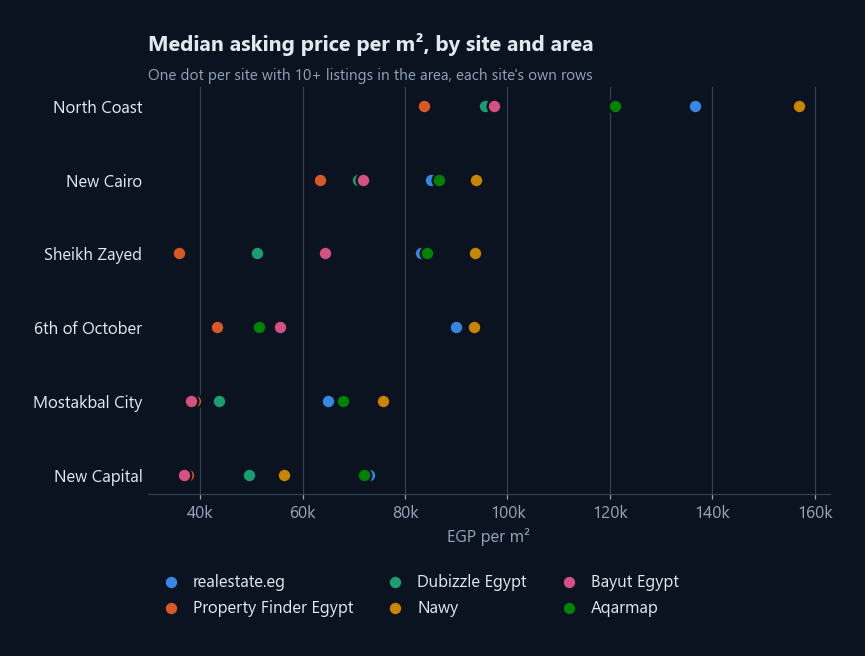
  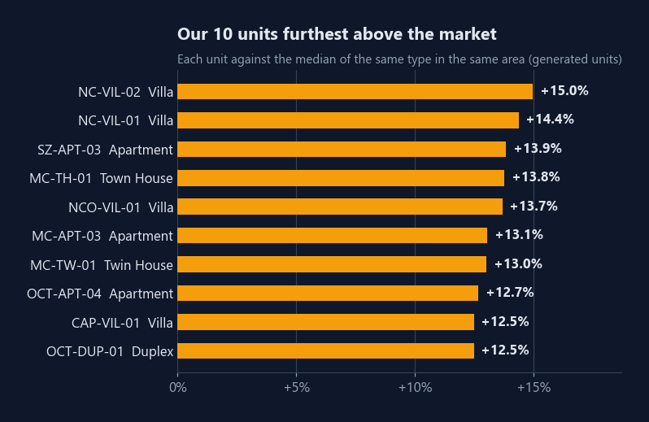
</p>
<p align="center"><sub>Left: each site's median in each area. Right: our ten units furthest above their market.</sub></p>

<p align="center">
  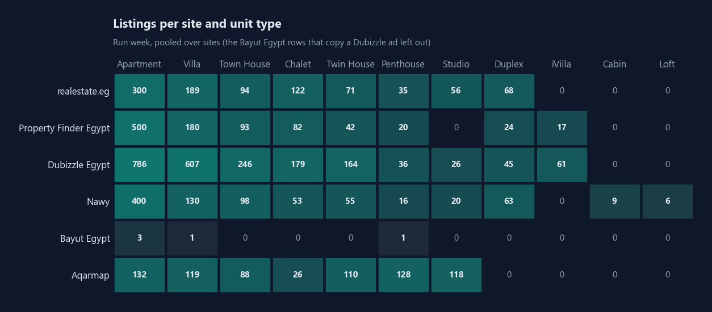
</p>
<p align="center"><sub>Listings per site and unit type, pooled over sites.</sub></p>

<p align="center">
  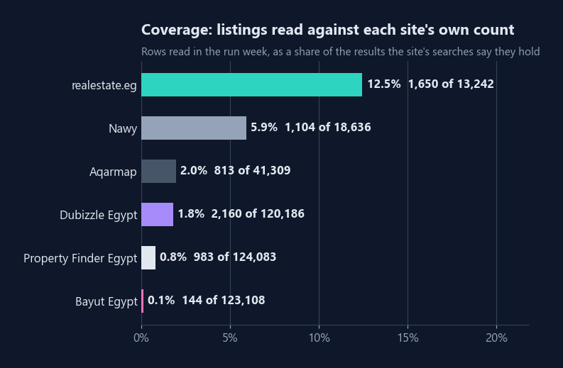
  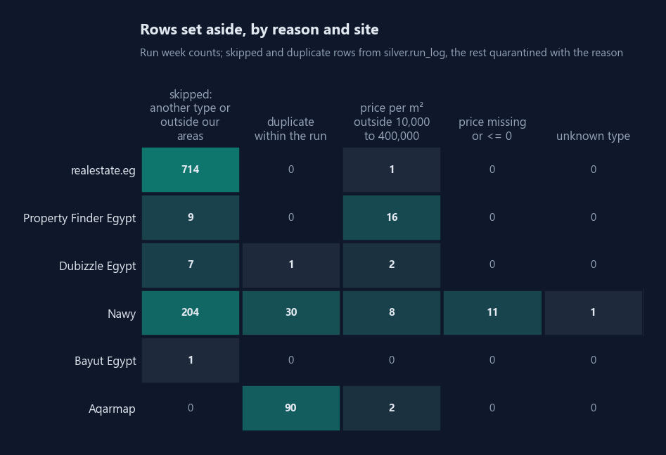
</p>
<p align="center"><sub>Left: listings read against each site's own count. Right: rows set aside, by reason and site.</sub></p>

<p align="center">
  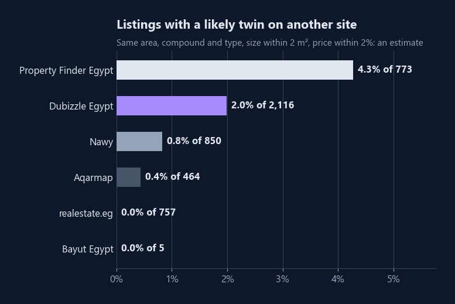
  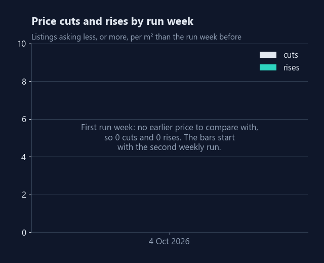
</p>
<p align="center"><sub>Left: listings with a likely twin on another site, about <!--nb:i7_twin_share_pct-->1.7<!--/nb-->%, an estimate. Right: cuts and rises by run week, <!--nb:price_cuts-->0<!--/nb--> cuts in the latest run week.</sub></p>

## 📦 For developers and brokerages

Each week you get your asking price per m² against the competing listings by area, compound and developer,
the listings that cut their price, and a refreshed Power BI report; the run prints the weekly summary
and sends no email. From you I need your units as one CSV (area, compound, type, size m² and asking
price) and the areas to watch. It runs as one Docker stack, weekly, on your machine or hosted by me.

## 📊 Power BI

The report reads the warehouse directly. The [powerbi/](powerbi/) folder rebuilds it from an
empty file by copy and paste: the queries, the model, every measure, every visual with its fields,
the theme, and the numbers each card must show.
<!-- Screenshots of the three pages go here once the report is built: powerbi/screenshots/ -->

## ▶️ Run it

You need Docker Desktop.

```bash
git clone https://github.com/omarshalabyy1/egypt-real-estate-prices
cd egypt-real-estate-prices
cp .env.example .env          # set WAREHOUSE_PASSWORD
docker compose up -d --build  # Airflow http://127.0.0.1:8101, warehouse localhost:5451
```

Open Airflow, unpause `egypt_real_estate_prices` and trigger it, from its page (Trigger DAG) or by
the API with a logical date. It then runs once a week on its own; a week already read is skipped,
so a rerun gives the same rows.

Then the numbers and the tests, in a virtual environment, with the stack still up:

```bash
python -m venv .venv && source .venv/bin/activate  # Windows: .venv\Scripts\activate
pip install -r analysis/requirements.txt
jupyter lab analysis/analysis.ipynb  # or headless:
python -m jupyter nbconvert --to notebook --execute --inplace analysis/analysis.ipynb
pip install -r requirements.txt pytest
export $(grep -E '^(WAREHOUSE_PASSWORD|WAREHOUSE_PORT)=' .env)  # else the warehouse tests skip
pytest
```

Bayut Egypt and Aqarmap are read once a week, before the run, by `python fetch_bayut_aqarmap.py`
in a visible browser window on my machine; before the first browser run, `pip install playwright`
and `python -m playwright install chromium`. I handle any check, cookie banner or login myself, and
the session is kept in `.browser-profile/` (gitignored, never committed). A fresh clone rebuilds
its history by a live read of the sites, because the raw pages stay on the machine: they contain
sellers' contact details. A live read takes at least <!--nb:live_read_minutes_estimate-->40<!--/nb--> minutes: the pauses alone, from this week's pages
on the slowest site at one request every <!--nb:live_read_request_seconds-->2.5<!--/nb--> seconds, before the sites' own response time (the automated sites are read in parallel).

| Where | What |
|---|---|
| [tracker.py](tracker.py) | The steps: extract, transform, load, build gold, report; one function each |
| [sites.py](sites.py) | Reading and parsing Property Finder Egypt, Dubizzle (OLX) Egypt and Nawy |
| [browser_sites.py](browser_sites.py) | Parsing the saved Bayut Egypt and Aqarmap pages |
| [fetch_bayut_aqarmap.py](fetch_bayut_aqarmap.py) | The weekly browser run for Bayut Egypt and Aqarmap |
| [dags/egypt_prices.py](dags/egypt_prices.py) | The weekly Airflow DAG `egypt_real_estate_prices` |
| [sql/schema.sql](sql/schema.sql) | The bronze, silver and gold tables and the gold views |
| [docs/layers.svg](docs/layers.svg) | The bronze, silver and gold layers |
| [config/client.yaml](config/client.yaml) | Every client value: the areas and each site's search address for them, the sites and their pace, the rules, the schedule, the colours |
| [data/input/](data/input/) | Our units ([columns](data/input/README.md)), checked before the warehouse is touched |
| [make_units.py](make_units.py) | How our units were made (run once) |
| [analysis/](analysis/) | The notebook behind every number |
| [powerbi/](powerbi/) | The report, step by step |
| [tests/](tests/) | Page parsing for every site, and the checks |

## 🗂️ Data

- **Competing listings:** residential units for sale in <!--nb:areas_read-->6<!--/nb--> areas (New Cairo, New Capital, Sheikh
  Zayed, 6th of October, North Coast and Mostakbal City), asking prices as each site shows them on
  the day of the run.
  - Read by the weekly Airflow run, one request every 2.5 seconds:
    [realestate.eg](https://realestate.eg),
    [Property Finder Egypt](https://www.propertyfinder.eg),
    [Dubizzle (OLX) Egypt](https://www.dubizzle.com.eg) and
    [Nawy](https://www.nawy.com).
  - Read once a week by a visible browser on one machine, one page every 5 seconds:
    [Bayut Egypt](https://www.bayut.eg) and [Aqarmap](https://aqarmap.com.eg).
- **No contact data:** contact details are kept neither in the warehouse nor in the repo; the raw
  pages stay on the machine that read them.
- **Our units** ([data/input/our_units.csv](data/input/our_units.csv)) are made up by
  [make_units.py](make_units.py): units inside real compounds seen on the sites, each priced near
  the market for its type and area, some above and some below. The client is not named; the
  competing listings are real.
